# Stori Audio & MIDI Engine Architecture

## Overview

This document visualizes the signal flow and component relationships in Stori's professional-grade audio and MIDI engine.

## Combined Audio & MIDI Engine Flow


## Threading Model

```mermaid
flowchart LR
    subgraph MainActor["🧵 MainActor (UI Thread)"]
        AudioEngine["AudioEngine<br/>(@Observable)"]
        TransportUI["Transport State"]
        MixerUI["Mixer Controls"]
        ProjectState["Project State"]
    end

    subgraph HighPriority["⚡ High Priority Queues (.userInteractive)"]
        MIDIQueue["com.stori.midi.scheduler<br/>(500Hz timer)"]
        AutoQueue["com.stori.automation<br/>(120Hz timer)"]
        PositionQueue["com.stori.transport.position<br/>(60Hz timer)"]
    end

    subgraph AudioThread["🔴 Audio Render Thread (real-time)"]
        RenderCallback["AVAudioEngine render"]
        LevelTaps["Level metering taps"]
        RecordTaps["Recording taps"]
    end

    subgraph Background["🔵 Background Queues"]
        HealthQueue["com.stori.engine.health<br/>(.utility)"]
        PluginLoad["Plugin loading<br/>(.userInitiated)"]
    end

    subgraph AtomicState["🔒 Thread-Safe State (os_unfair_lock)"]
        BeatPosition["atomicBeatPosition"]
        LevelData["level data"]
        AutoData["automation snapshots"]
        MIDIBlockCache["MIDI block cache"]
    end

    MainActor <--> |"@MainActor isolation"| TransportUI
    MainActor <--> MixerUI
    MainActor <--> ProjectState

    MIDIQueue --> |"reads"| BeatPosition
    AutoQueue --> |"reads"| BeatPosition
    AutoQueue --> |"batch reads"| AutoData
    PositionQueue --> |"updates"| BeatPosition

    AudioThread --> |"writes"| LevelData
    MainActor --> |"reads"| LevelData

    HighPriority --> |"schedules events"| AudioThread

    style MainActor fill:#e3f2fd
    style HighPriority fill:#fff3e0
    style AudioThread fill:#ffebee
    style Background fill:#f5f5f5
    style AtomicState fill:#e8f5e9
```



## Key Design Decisions

### Beats-First Architecture
All positions are stored and calculated in **musical time (beats)**, not seconds. Conversion to seconds/samples only happens at the AVAudioEngine boundary.

### Sample-Accurate MIDI
MIDI events are scheduled with calculated **future sample times** using `AUScheduleMIDIEventBlock`. The scheduler runs at 500Hz and pushes events 50-100ms ahead, allowing the Audio Unit to fire events at exactly the right sample.

### Real-Time Safety
- No allocations on audio thread
- No locks that block audio (only `os_unfair_lock` with immediate return)
- All timers use `DispatchSourceTimer` (immune to main thread blocking)
- Batch reads for automation (O(1) lock acquisitions per update cycle)

### Graceful Degradation
- Master limiter prevents clipping at output
- Plugin greylist for crash detection
- Health monitoring with automatic recovery
- RAII patterns for state consistency

## Signal Flow Summary

```
Audio Track: PlayerNode → TimePitch → [PluginChain] → EQ → Volume → Pan → MainMixer
MIDI Track:  Sampler → TimePitch → [PluginChain] → EQ → Volume → Pan → MainMixer
Bus Return:  BusInput → [BusPlugins] → Volume → Pan → MainMixer
Master:      MainMixer → MasterEQ → MasterLimiter → OutputNode → Hardware
```
